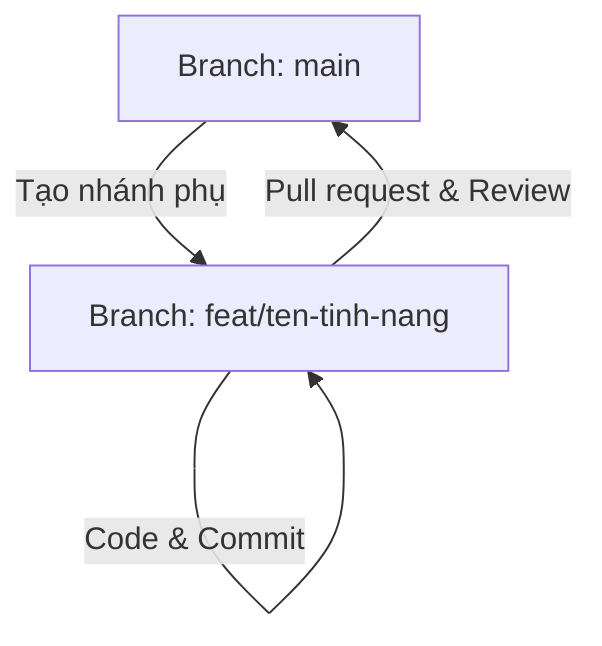

# Quy tắc Làm việc nhóm & Quy trình Git (Git Workflow) - NovaPhone Team

Tài liệu này quy định các nguyên tắc cộng tác, quy trình quản lý mã nguồn (Git) và các quy chuẩn viết code nhằm đảm bảo tính đồng bộ, hạn chế tối đa xung đột (conflict) và nâng cao hiệu suất làm việc của nhóm phát triển dự án NovaPhone.

---

## I. Quy trình Làm việc với Git (Git Workflow)

NovaPhone Team áp dụng mô hình **Feature Branch Workflow** (Phát triển trên các nhánh tính năng).



### 1. Phân chia Nhánh (Branching Strategy)
- **`main`**: Nhánh chính chứa mã nguồn ổn định, đã sẵn sàng chạy thực tế. Tuyệt đối **không** commit code trực tiếp lên nhánh này.
- **Nhánh Tính năng / Sửa lỗi (`feat/*`, `fix/*`)**: Mỗi lập trình viên khi làm một task phải tự tạo nhánh riêng từ `main` mới nhất:
  - Thêm tính năng mới: `feat/ten-chuc-nang` (Ví dụ: `feat/login-google`, `feat/cart-page`)
  - Sửa lỗi: `fix/ten-loi` (Ví dụ: `fix/reset-password-method`, `fix/db-inventory-migration`)
  - Tối ưu/Cải tiến: `refactor/ten-phan-viec` (Ví dụ: `refactor/auth-controller`)

### 2. Chu kỳ Làm việc Hàng ngày (Daily Routine)
Để tránh bị conflict quá nặng nề khi gom code vào cuối dự án:
1. Đầu ngày làm việc: Chuyển về nhánh `main` và lấy code mới nhất:
   ```bash
   git checkout main
   git pull origin main
   ```
2. Cập nhật nhánh làm việc của mình: Merge `main` mới nhất vào nhánh cá nhân:
   ```bash
   git checkout feat/my-feature
   git merge main
   ```
3. Tiến hành viết code và commit thường xuyên. Không gom quá nhiều tính năng lớn vào một commit duy nhất.

---

## II. Quy tắc Commit & Viết Code (Coding & Commit Conventions)

### 1. Thông điệp Commit (Commit Messages)
Thông điệp commit cần ngắn gọn, rõ nghĩa và phản ánh đúng những gì thay đổi:
- Định dạng: `<loại>: <nội dung ngắn gọn bằng tiếng Việt>`
- Ví dụ:
  - `feat: tích hợp đăng nhập bằng tài khoản Google`
  - `fix: sửa lỗi thiếu phương thức đặt lại mật khẩu`
  - `chore: dọn dẹp các tệp tin debug tạm thời`

### 2. Tránh trùng lặp cấu trúc code (Code Duplication)
Trước khi tạo mới một **Controller**, **Model**, **Service** hay **Migration**:
- Kiểm tra kỹ xem trong dự án đã có tệp tương tự hoặc đã có ai làm phần đó chưa.
- **Không tự ý tạo các thư mục song song** giải quyết cùng một nghiệp vụ (ví dụ: tạo 2 file `AuthController` ở 2 thư mục khác nhau là sai quy định). Nếu cần mở rộng, hãy sửa đổi trực tiếp tệp cũ hoặc kế thừa đúng cách.

---

## III. Quy trình Giải quyết Xung đột (Conflict Resolution)

Khi bạn thực hiện `git merge` hoặc khi tạo Pull Request trên GitHub/GitLab và gặp thông báo **Conflict**:

### 1. Nguyên tắc cốt lõi
- **Không tự ý phán đoán**: Nếu xung đột xảy ra ở file do thành viên khác viết hoặc chỉnh sửa trước đó, **bắt buộc** phải ngồi lại trao đổi với thành viên đó trước khi nhấn nút giải quyết xung đột.
- **Xử lý triệt để**: Phải mở trực tiếp file bị conflict, xóa toàn bộ các conflict marker (`<<<<<<<`, `=======`, `>>>>>>>`) và sửa code sao cho chương trình hoạt động đúng. Tuyệt đối không commit file chứa các marker này lên repo.

### 2. Đồng bộ hóa File Package (`composer.json`, `composer.lock`)
File thư viện của Laravel thường rất dễ bị conflict khi nhiều người cùng cài package. Khi giải quyết conflict:
1. Sửa cú pháp trong file `composer.json` trước để nó trở thành tệp JSON hợp lệ.
2. Xóa các conflict marker trong `composer.lock` để tệp có định dạng JSON hợp lệ.
3. Chạy lệnh cập nhật file lock tự động:
   ```bash
   composer update --lock
   ```
   Lệnh này sẽ tính toán lại mã băm (content-hash) và đồng bộ tệp lock một cách an toàn mà không cài đặt lại toàn bộ thư viện.

---

## IV. Quy trình Gửi & Review Pull Request (PR)

1. **Kiểm tra trước khi tạo PR:**
   - Chạy thử dự án tại máy local (`php artisan serve`, `npm run dev`) để đảm bảo không lỗi cú pháp.
   - Chạy lệnh kiểm tra định tuyến: `php artisan route:list`.
2. **Review chéo:**
   - Mỗi Pull Request phải có ít nhất 1 thành viên khác trong nhóm kiểm tra (Review) và chấp thuận (Approve) trước khi được merge vào nhánh `main`.
   - Người review có trách nhiệm kiểm tra xem code có vi phạm quy tắc trùng lặp hay cấu trúc thư mục không.

Tuân thủ nghiêm ngặt các quy tắc trên sẽ giúp NovaPhone Team hạn chế tối đa các lỗi ngớ ngẩn và nâng cao chất lượng sản phẩm!
